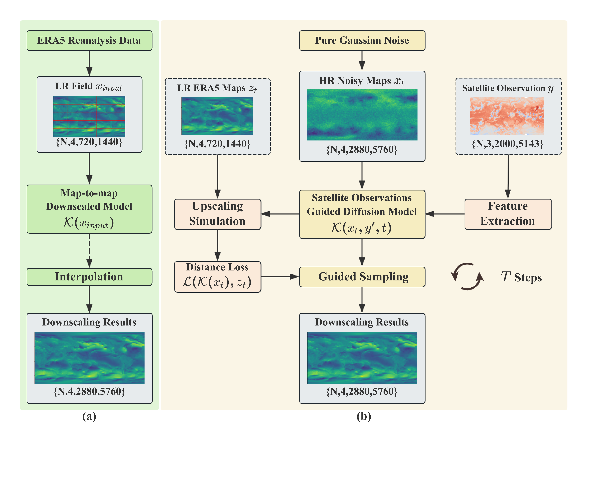

<div align="center">

<h1>Satellite Observations Guided Diffusion Model for Accurate Meteorological States at Arbitrary Resolution</h1>

In this paper, we strive to construct a conditional diffusion model by incorporating the brightness temperature data from GridSat satellite observations. Additionally, during the sampling process, we will add guidance from the low-resolution ERA5 to generate high-quality high-resolution ERA5 maps.

<div>
    <a target='_blank'>Siwei Tu</a><sup>1</sup>&emsp;
    <a target='_blank'>Ben Fei</a><sup>2,3,†</sup>&emsp;
    <a target='_blank'>Weidong Yang</a><sup>1,†</sup>&emsp;
    <a target='_blank'>Fenghua Ling</a><sup>2</sup>&emsp;
    <a target='_blank'>Hao Chen</a><sup>2</sup>&emsp;
    <a target='_blank'>Zili Liu</a><sup>4</sup>&emsp;
    <a target='_blank'>Kun Chen</a><sup>1,2</sup>&emsp;
    <a target='_blank'>Hang Fan</a><sup>2,5</sup>&emsp;
    <a target='_blank'>Wanli Ouyang</a><sup>2,3</sup>&emsp;
    <a target='_blank'>Lei Bai</a><sup>2</sup>&emsp;
</div>

<div>
    <sup>1</sup>Fudan University&emsp; 
    <sup>2</sup>Shanghai Artificial Intelligence Laboratory&emsp;   
    <sup>3</sup>Chinese University of Hong Kong&emsp;   
    <sup>4</sup>Beihang University&emsp;     
    <sup>5</sup>Nanjing University of Information Science and Technology&emsp;     

</div>

Teaser of SGD:


Framework of SGD:


---

</div>


## :diamonds: Training
The code is the March version. 

Before starting the training, you can independently set the parameter values to be used, as shown below

```
MODEL_FLAGS="--image_size 512 --num_channels 64 --num_res_blocks 2"
DIFFUSION_FLAGS="--diffusion_steps 1000 --noise_schedule linear"
TRAIN_FLAGS="--lr 1e-4 --batch_size 1"
```

Use the image_train.py to start training.

```
python image_train.py --channel 4 --cond_channel 3 --size_x 720 --size_y 1440 --cond_x 2000 --cond_y 5143 $MODEL_FLAGS $DIFFUSION_FLAGS $TRAIN_FLAGS
```


### :fire:Sampling

Utilize the low-resolution ERA5 maps and w5k data to guide the sampling process.

```
python image_sample.py $MODEL_FLAGS $DIFFUSION_FLAGS
```

Utilize the w5k data to guide the sampling process by adjusting the loss function in image_sample_guide.py.

```
python image_sample_guide.py $MODEL_FLAGS $DIFFUSION_FLAGS
```


## :clap: Acknowledgement

Our paper is inspired by:
- [https://generativediffusionprior.github.io/](https://generativediffusionprior.github.io/)(the GDP repo)
- [https://github.com/Stability-AI/stablediffusion.git](https://github.com/Stability-AI/stablediffusion.git)(the Stable Diffusion repo)

Thanks for their awesome works!

If you have any inquiries, please feel free to consult via email tusiwei906@gmail.com .
